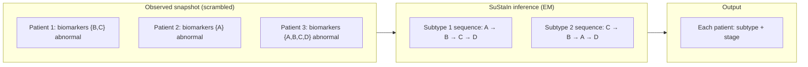
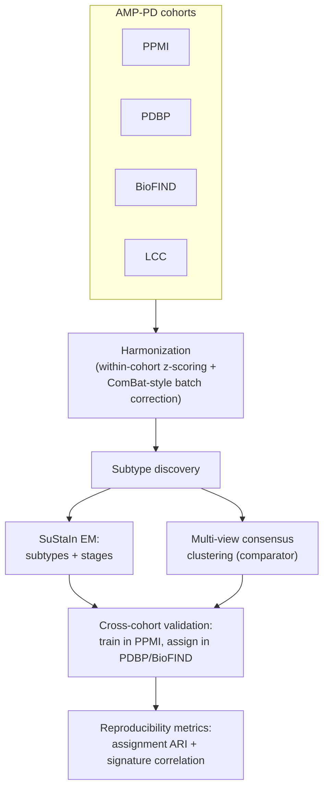
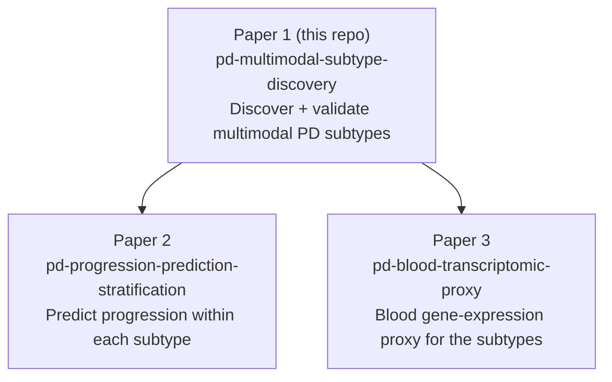

# Extended Introduction — Parkinson's, Biomarkers, and Data-Driven Subtyping

**No neuroscience background required.** This page explains, from zero, what
Parkinson's disease is, why it is really many diseases wearing one label, what
the data in this project actually are, and what the algorithms do — in plain
language. For the scientific version with full references, see
[INTRODUCTION.md](INTRODUCTION.md); citations like [1] refer to that file's
reference list.

---

## 1. What is Parkinson's disease?

Deep in your brain there is a small region called the *substantia nigra* whose
neurons produce **dopamine**, a chemical messenger that helps initiate and
smooth movement. In Parkinson's disease (PD) these dopamine neurons gradually
die [1]. When enough of them are gone, the classic motor symptoms appear:
slowness of movement (bradykinesia), shaking at rest (tremor), and stiffness
(rigidity). A diagnosis is made when these signs show up on a clinical exam.

But PD is not only a movement disorder. Most patients also develop
**non-motor symptoms**: loss of smell (often years before diagnosis), sleep
disturbances, constipation, depression, and — later in many patients —
cognitive decline and dementia [1]. Under the microscope, the dying neurons
contain clumps of a misfolded protein called **alpha-synuclein**, packed into
structures called Lewy bodies. Where those clumps spread in the brain seems to
determine which symptoms a patient gets and how fast they come [1].

PD is the second most common neurodegenerative disease after Alzheimer's.

## 2. Why "Parkinson's" is really many diseases with one label

Here is the uncomfortable fact that motivates this entire repository: two
people can receive the *same diagnosis on the same day* and have completely
different futures.

- Some patients stay mild and stable for a decade or more (**slow
  progressors**); others move quickly to falls, wheelchair dependence, and
  dementia (**fast progressors**).
- Some patients are **tremor-first**: shaking dominates, cognition stays
  sharp for years. Others are **cognition-first / gait-first**: little tremor,
  but early balance problems, hallucinations, and memory decline — the
  so-called "diffuse malignant" course [9].

This is **heterogeneity**, and it is a core challenge in modern PD research
[1]. Clinicians have long sorted patients by eye into buckets like
"tremor-dominant" vs. "postural-instability/gait-difficulty," and prospective
studies showed these buckets really do progress differently [9] and map onto
measurable biological differences [10].

Why it matters beyond bedside care: clinical trials of drugs meant to *slow*
the disease enroll "PD" as if it were one disease. If a drug works only in one
hidden subtype, mixing all subtypes together dilutes the effect and the trial
fails — one plausible contributor to the long string of negative
neuroprotection trials [1]. Finding the hidden subtypes is therefore not
academic bookkeeping; it is a prerequisite for smarter trials, honest
prognoses, and mechanism-targeted therapies.

## 3. What are biomarkers?

A **biomarker** is a measurable stand-in for a biological process you cannot
observe directly. You can't peek into a living brain and count dying dopamine
neurons, so we measure proxies:

| Biomarker | Plain-language meaning |
|---|---|
| **DaTscan** | A *photo of the dopamine terminals*. A radioactive tracer binds to the dopamine transporter on the nerve endings; a gamma camera images where it lands. Healthy brain: two bright comma-shaped blobs. PD brain: dim, shrunken dots. It quantifies how much dopaminergic machinery is left [3,4]. |
| **CSF** (cerebrospinal fluid) | *Tapping the brain's plumbing*. A clear fluid bathes the brain and spinal cord; a lumbar puncture draws a sample. Proteins in it — alpha-synuclein, amyloid-beta, tau — are molecular footprints of what is going wrong in the tissue [3,4]. |
| **MRI** | A detailed structural picture of the brain. It captures atrophy (shrinkage) patterns and rules out other causes of symptoms. |
| **Clinical rating scales** | Standardized scorecards. The **MDS-UPDRS** [2] is the main one: a clinician rates dozens of items (tremor, gait, speech, daily activities, mood, cognition) into numeric scores, so "how bad is it?" becomes data. The **MoCA** is a quick cognitive screening test. |

This project treats these as **views** of the same disease: clinical, imaging
(MRI/DaTscan), and CSF. Using several views at once is what "multimodal"
means — each view catches aspects of heterogeneity the others miss.

## 4. What is AMP-PD?

No single study is big enough or diverse enough to find trustworthy subtypes.
The **Accelerating Medicines Partnership in Parkinson's Disease (AMP-PD)**
pools four deeply characterized cohorts onto one cloud platform [5]:

- **PPMI** (Parkinson's Progression Markers Initiative) — the flagship,
  largest subset [3,4];
- **PDBP** (Parkinson's Disease Biomarkers Program) — ~1,500+ participants;
- **BioFIND** — ~200 participants;
- **LCC** (LRRK2 Cohort Consortium) — ~100 participants.

Combined: ~4,000+ participants with clinical scores, MRI, DaTscan, CSF,
whole-genome sequencing, and blood RNA sequencing, followed longitudinally
[5]. Access is controlled: researchers apply for Tier 2 access under a Data
Use Agreement and work inside the Terra cloud platform (see
[DATA_ACCESS.md](DATA_ACCESS.md)).

## 5. What is "data-driven subtyping"?

Instead of a doctor defining subtypes by intuition ("tremor-dominant"),
**data-driven subtyping lets the data find the patient groups itself**.

A useful analogy: a streaming service doesn't ask you whether you're a
"rom-com person" — it clusters viewing histories and discovers taste groups
that no one named in advance, then uses those groups to predict what you'll
like next. We do the same thing, except the rows are patients, the columns are
biomarkers, and the "tastes" are distinct disease courses. The groups that
fall out of the data — if they hold up — *are* the subtypes.

Two ingredients make this more than ordinary clustering:

1. **Multimodal data.** We cluster on clinical scores + imaging + CSF
   simultaneously (multi-view clustering), not one score at a time.
2. **Progression.** Patients are at different points in their disease, so we
   don't just ask "which group are you in?" but also "how far along are you?"
   — which is exactly what SuStaIn does.

## 6. SuStaIn in plain terms

**Subtype and Stage Inference (SuStaIn)** [6] solves a puzzle: imagine 1,000
runners each ran the same race, but everyone started at a different time, and
you only get one snapshot showing where each runner is *right now*. Can you
reconstruct the race route — and figure out that there were actually *two
different races* happening at once?

That is the situation with PD. We have (mostly) cross-sectional data: one
snapshot per patient. Some patients are early, some late; and there may be
several distinct "routes" the disease can take (e.g., biomarkers becoming
abnormal in different orders). SuStaIn unscrambles this: it simultaneously
learns

- the **subtypes** — the distinct sequences in which biomarkers turn abnormal
  (e.g., subtype A: DaTscan first, then gait scores; subtype B: cognitive and
  CSF changes first), and
- each patient's **stage** — how far along their subtype's sequence they are.

Under the hood, SuStaIn is fit with the **EM algorithm**: *alternate between
guessing each patient's hidden label (subtype & stage) and re-estimating the
subtypes given those guesses, repeating until the guesses stop improving.*
For a visual intuition, see the 3Blue1Brown-style explanations of EM and
Gaussian mixture models ([StatQuest: EM & Gaussian Mixtures](https://statquest.org/),
[3Blue1Brown](https://www.3blue1brown.com/)) — we won't re-teach them here.

## 7. The pipeline, end to end

Current status is important: the full pipeline above is **implemented and
tested end-to-end on a semi-synthetic stand-in dataset** (240 subjects, 3
cohorts, 12 features, 2 planted subtypes — recovered with cross-cohort
assignment agreement ARI ≈ 0.95–1.0; see `reports/subtyping_summary.json`),
but **no real patient data has been analyzed yet**. Real-data analysis is
blocked pending the AMP-PD Tier 2 Data Use Agreement (see
[DATA_ACCESS.md](DATA_ACCESS.md) and [METHODS.md](METHODS.md) for the
Done-vs-Intended breakdown).

## 8. The three bits of math you actually need

Each concept is one plain sentence plus a link — learn the details there.

1. **Z-scoring.** Rescale each measurement into "how many standard deviations
   above/below average is this?" so a 4-point tremor score and a 0.2-unit
   DaTscan drop become comparable numbers. ([Seeing Theory](https://seeing-theory.brown.edu/),
   [StatQuest: Normal distributions & z-scores](https://statquest.org/))
   In our pipeline the z-scoring is done *within each cohort first*, so
   cohort-specific quirks don't masquerade as biology.
2. **ARI (Adjusted Rand Index).** A 0-to-1 score for how much two clusterings
   of the same people agree, corrected so that random chance scores ≈ 0; 1.0
   means identical groupings. We use it to check whether subtypes discovered
   in PPMI reproduce when transferred to PDBP or BioFIND.
   ([StatQuest](https://statquest.org/))
3. **EM algorithm.** One sentence: keep alternating between (E) guessing the
   hidden labels of each data point and (M) re-fitting the model to those
   guesses, and each round provably improves (or holds) the fit until it
   converges. ([3Blue1Brown / EM & GMM intuition](https://www.3blue1brown.com/),
   [Seeing Theory](https://seeing-theory.brown.edu/))

## 9. Where this paper sits in the series

This repository is **Paper 1 of 3** — the foundation. Papers 2 and 3 reuse the
subtype definitions discovered here, which is why reproducibility and open
assignment code matter so much.

## 10. Glossary cheat-sheet

- **Cohort** — one research study's collection of participants (PPMI, PDBP, …).
- **Harmonization** — making measurements from different cohorts comparable.
- **Subtype** — a data-discovered group of patients with a shared disease pattern.
- **Stage** — how far along a subtype's progression sequence a patient is.
- **Cross-cohort validation** — discover in one cohort, test in another; the
  gold standard for "is this real?"
- **DUA / Tier 2 / Terra** — the legal agreement, access level, and cloud
  platform governing AMP-PD data ([DATA_ACCESS.md](DATA_ACCESS.md)).

*Next: [METHODS.md](METHODS.md) for how the pipeline works and why each
decision was made.*
