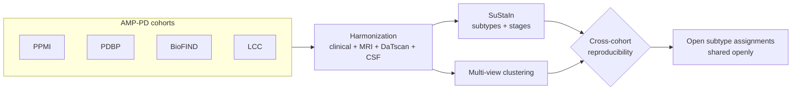
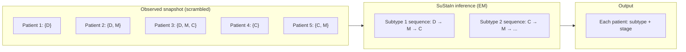
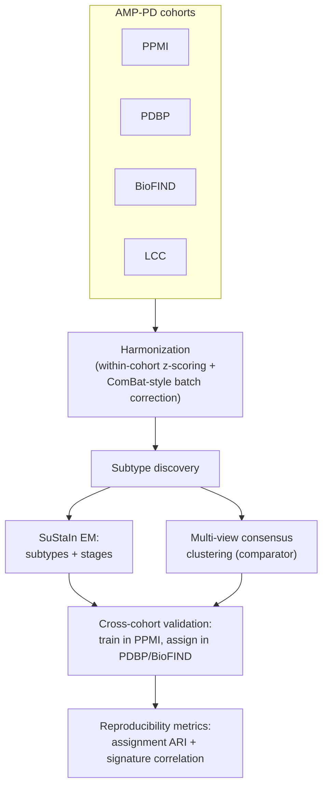

# Extended Introduction — Parkinson's, Biomarkers, and Data-Driven Subtyping

**No background in neuroscience, medicine, or statistics required.** Every technical idea on this page is first worked out on a tiny made-up example you can check with pencil and paper, then given intuition, then — only at the end — its formal name, used as shorthand for the procedure you already did. For the scientific version with full references, see [INTRODUCTION.md](INTRODUCTION.md); citations like [1] refer to that file's reference list.

**Concept figure.** Four AMP-PD cohorts are harmonized across clinical scores, MRI, DaTscan, and CSF; two discovery engines (SuStaIn and multi-view clustering) propose subtypes; and only structure that survives cross-cohort transfer becomes the open subtype assignments released for reuse (standalone version: [figures/concept_figure.md](figures/concept_figure.md)):

## 1. What is Parkinson's disease?

Deep in your brain there is a small region called the *substantia nigra* whose neurons produce **dopamine**, a chemical messenger that helps initiate and smooth movement. In Parkinson's disease (PD) these dopamine neurons gradually die [1]. When enough of them are gone, the classic motor symptoms appear: slowness of movement (bradykinesia), shaking at rest (tremor), and stiffness (rigidity). A diagnosis is made when these signs show up on a clinical exam.

But PD is not only a movement disorder. Most patients also develop **non-motor symptoms**: loss of smell (often years before diagnosis), sleep disturbances, constipation, depression, and — later in many patients — cognitive decline and dementia [1]. Under the microscope, the dying neurons contain clumps of a misfolded protein called **alpha-synuclein**, packed into structures called Lewy bodies. Where those clumps spread in the brain seems to determine which symptoms a patient gets and how fast they come [1].

PD is the second most common neurodegenerative disease after Alzheimer's.

## 2. Why "Parkinson's" is really many diseases with one label

Here is the uncomfortable fact that motivates this entire repository: two people can receive the *same diagnosis on the same day* and have completely different futures.

- Some patients stay mild and stable for a decade or more (**slow progressors**); others move quickly to falls, wheelchair dependence, and dementia (**fast progressors**).
- Some patients are **tremor-first**: shaking dominates, cognition stays sharp for years. Others are **cognition-first / gait-first**: little tremor, but early balance problems, hallucinations, and memory decline — the so-called "diffuse malignant" course [9].

This is **heterogeneity**, and it is a core challenge in modern PD research [1]. Clinicians have long sorted patients by eye into buckets like "tremor-dominant" vs. "postural-instability/gait-difficulty," and prospective studies showed these buckets really do progress differently [9] and map onto measurable biological differences [10].

Why it matters beyond bedside care: clinical trials of drugs meant to *slow* the disease enroll "PD" as if it were one disease. If a drug works only in one hidden subtype, mixing all subtypes together dilutes the effect and the trial fails — one plausible contributor to the long string of negative neuroprotection trials [1]. Finding the hidden subtypes is therefore not academic bookkeeping; it is a prerequisite for smarter trials, honest prognoses, and mechanism-targeted therapies.

## 3. What are biomarkers?

A **biomarker** is a measurable stand-in for a biological process you cannot observe directly. You can't peek into a living brain and count dying dopamine neurons, so we measure proxies:

| Biomarker | Plain-language meaning |
|---|---|
| **DaTscan** | A *photo of the dopamine terminals*. A radioactive tracer binds to the dopamine transporter on the nerve endings; a gamma camera images where it lands. Healthy brain: two bright comma-shaped blobs. PD brain: dim, shrunken dots. It quantifies how much dopaminergic machinery is left [3,4]. |
| **CSF** (cerebrospinal fluid) | *Tapping the brain's plumbing*. A clear fluid bathes the brain and spinal cord; a lumbar puncture draws a sample. Proteins in it — alpha-synuclein, amyloid-beta, tau — are molecular footprints of what is going wrong in the tissue [3,4]. |
| **MRI** | A detailed structural picture of the brain. It captures atrophy (shrinkage) patterns and rules out other causes of symptoms. |
| **Clinical rating scales** | Standardized scorecards. The **MDS-UPDRS** [2] is the main one: a clinician rates dozens of items (tremor, gait, speech, daily activities, mood, cognition) into numeric scores, so "how bad is it?" becomes data. The **MoCA** is a quick cognitive screening test. |

This project treats these as **views** of the same disease: clinical, imaging (MRI/DaTscan), and CSF. Using several views at once is what "multimodal" means — each view catches aspects of heterogeneity the others miss.

## 4. Harmonization, by hand: making four studies speak one language

Before anything can be combined, we must face a boring but lethal problem: each cohort measures things its own way. Tiny example. Six patients, three from cohort P and three from cohort Q, each with a tremor score and a DaTscan number:

| Patient | Cohort | Tremor score | DaTscan |
|---|---|---|---|
| a | P | 12 | 0.9 |
| b | P | 16 | 1.1 |
| c | P | 20 | 1.0 |
| d | Q | 3 | 2.8 |
| e | Q | 5 | 3.2 |
| f | Q | 4 | 3.0 |

Is patient a (tremor 12) worse than patient d (tremor 3)? Nobody knows — P and Q may use different scales, and their scanners certainly differ. The fix is to **rescale within each cohort first**: express every number as "how far above/below *this cohort's* average, in units of *this cohort's* typical spread." Cohort P's tremor average is 16 with spread 4, so patient a becomes (12−16)/4 = **−1.0**; cohort Q's average is 4 with spread 1, so patient d becomes (3−4)/1 = **−1.0**. On the rescaled numbers, a and d are equally *mild for their cohort* — a fair comparison.

That's a **z-score**, and doing it within each cohort before pooling is the simplest form of harmonization. (The pipeline also uses a ComBat-style batch correction on top — the same "subtract each group's systematic shift, keep the biology" procedure worked through in the MDD sister project's extended introduction — and fills gaps in the table with **multiple imputation**: instead of one guessed value for a missing measurement, it fills in several plausible values, carries them all through the analysis, and lets the disagreement between them honestly inflate the uncertainty.)

## 5. What is "data-driven subtyping"? A worked miniature

Instead of a doctor defining subtypes by intuition ("tremor-dominant"), **data-driven subtyping lets the data find the patient groups itself**. Here is the whole idea on six (already harmonized) patients with two features each:

| Patient | Motor z | Cognition z |
|---|---|---|
| a | 2.1 | 0.2 |
| b | 1.8 | −0.1 |
| c | 2.4 | 0.3 |
| d | 0.1 | −2.2 |
| e | −0.2 | −1.9 |
| f | 0.3 | −2.5 |

Plot them: a, b, c are the "motor-first" corner; d, e, f are the "cognition-first" corner. A clustering algorithm (e.g., k-means: guess centers → assign each point to its nearest center → move centers to their points' average → repeat) finds those two groups automatically. **Multi-view clustering** is the same thing when each patient has several *kinds* of features (clinical, imaging, CSF): cluster each view, then keep only the grouping the views agree on — a committee vote rather than a single opinion.

The streaming-service analogy: nobody tells the algorithm the genre names; the groups emerge, and if they hold up, they *are* the subtypes.

## 6. SuStaIn in plain terms: unscrambling a race from one snapshot

Ordinary clustering misses something crucial: patients are at different points in their disease. **Subtype and Stage Inference (SuStaIn)** [6] solves a puzzle: imagine 1,000 runners each ran the same race, but everyone started at a different time, and you only get one snapshot showing where each runner is *right now*. Can you reconstruct the race route — and figure out that there were actually *two different races* happening at once?

A hand-checkable miniature. Suppose three biomarkers (D = DaTscan, M = motor score, C = cognitive score) each flip from normal to abnormal at some point, and we get one snapshot per patient:

- Patient 1: only D abnormal
- Patient 2: D and M abnormal
- Patient 3: D, M, and C abnormal
- Patient 4: only C abnormal
- Patient 5: C and M abnormal

Patients 1–3 fit the sequence **D → M → C** at increasing "distance along the route." Patients 4–5 fit a different route, **C → M → …**. SuStaIn formalizes exactly this: it searches for the small set of sequences ("subtypes") and per-patient positions ("stages") that best explain all snapshots at once.

How does the computer search? By the same two-step rhythm you'd use by hand: (1) *given* a guess at the sequences, assign each patient to the sequence and position that best matches their snapshot; (2) *given* those assignments, re-estimate the sequences to fit the assigned patients. Alternate until nothing improves. That rhythm is called the **EM algorithm** — no more mysterious than "guess labels, refit, repeat."

## 7. Is it real? Cross-cohort reproducibility, on a tiny example

Any algorithm returns groups, even from noise — so the only test that matters is whether the groups show up in data the algorithm never saw. The procedure, stripped bare:

1. Discover subtypes in cohort P only (say, the "motor-first" and "cognition-first" groups of Section 5).
2. Freeze everything: the group definitions, the centers, the assignment rule.
3. Take the untouched patients from cohort Q and assign each to the nearest frozen group.
4. Check: do Q's patients land in the same proportions, with the same biomarker profiles, and — independently — does clustering *Q on its own* produce a matching grouping?

Step 4's agreement is measured by the **adjusted Rand index (ARI)**, which you can compute by hand on six patients: take all 15 pairs of patients, and for each pair ask whether the two groupings agree ("same group in both" or "different in both"). ARI is that agreement rate, corrected so random chance scores ≈ 0 and perfect agreement scores 1. Our semi-synthetic demo (240 subjects, 3 cohorts, 12 features, 2 planted subtypes) recovers the planted structure with cross-cohort assignment ARI ≈ 0.95–1.0 (see `reports/subtyping_summary.json`) — the machinery works; real data will decide the science.

The pipeline also checks **subtype–genotype associations** against known PD risk loci [7] as an orthogonal validator: if a subtype is real biology, it may correlate with genetic features the clustering never saw.

## 8. What is AMP-PD?

No single study is big enough or diverse enough to find trustworthy subtypes. The **Accelerating Medicines Partnership in Parkinson's Disease (AMP-PD)** pools four deeply characterized cohorts onto one cloud platform [5]: **PPMI** (the flagship, largest subset [3,4]), **PDBP** (~1,500+ participants), **BioFIND** (~200), and **LCC** (~100). Combined: ~4,000+ participants with clinical scores, MRI, DaTscan, CSF, whole-genome sequencing, and blood RNA sequencing, followed longitudinally [5]. Access is controlled: researchers apply for Tier 2 access under a Data Use Agreement and work inside the Terra cloud platform (see [DATA_ACCESS.md](DATA_ACCESS.md)).

## 9. The pipeline, end to end — and its current status

Current status is important: the full pipeline above is **implemented and tested end-to-end on a semi-synthetic stand-in dataset**, but **no real patient data has been analyzed yet**. Real-data analysis is blocked pending the AMP-PD Tier 2 Data Use Agreement (see [DATA_ACCESS.md](DATA_ACCESS.md) and [METHODS.md](METHODS.md) for the Done-vs-Intended breakdown).

## 11. Glossary cheat-sheet

- **Cohort** — one research study's collection of participants (PPMI, PDBP, …).
- **Harmonization** — making measurements from different cohorts comparable (Section 4's rescaling, plus ComBat-style shift removal).
- **Subtype** — a data-discovered group of patients with a shared disease pattern.
- **Stage** — how far along a subtype's progression sequence a patient is.
- **Cross-cohort validation** — discover in one cohort, test in another; the gold standard for "is this real?"
- **DUA / Tier 2 / Terra** — the legal agreement, access level, and cloud platform governing AMP-PD data ([DATA_ACCESS.md](DATA_ACCESS.md)).

*Next: [METHODS.md](METHODS.md) for how the pipeline works and why each decision was made.*
