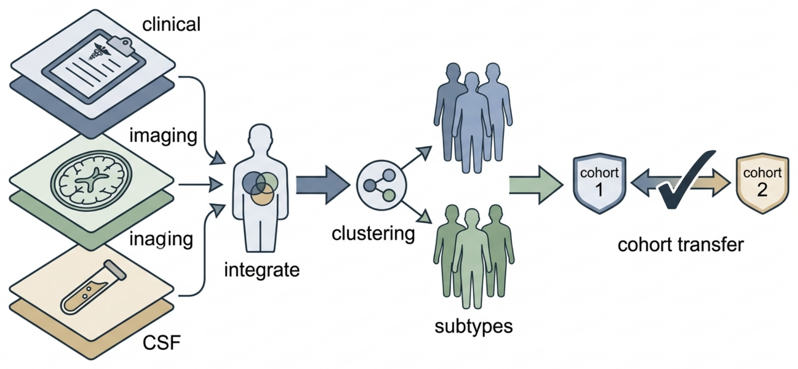

# Introduction — PD Multimodal Subtype Discovery

## Concept figure

The pipeline in one picture — four AMP-PD cohorts are harmonized across clinical, imaging, and CSF features; SuStaIn and multi-view clustering propose subtypes; and only structure that survives cross-cohort transfer becomes the open subtype assignments released for reuse (standalone version: [figures/concept_figure.md](figures/concept_figure.md)):

*Figure 1: Three data modalities are aligned per patient and clustered, and only structure transferring across cohorts is kept. (Editable Mermaid source: [figures/concept_figure.md](figures/concept_figure.md).)*

## Background

Parkinson's disease (PD) is the second most common neurodegenerative disorder and one of the most heterogeneous. Two patients with the same initial diagnosis — bradykinesia plus rest tremor or rigidity — can follow radically different courses: some remain stable for a decade, others progress rapidly to gait failure, falls, and dementia. This heterogeneity is a core challenge in modern PD research and management [1]. Neuropathologically, PD is defined by the loss of nigrostriatal dopamine neurons and by the accumulation of misfolded alpha-synuclein in Lewy bodies and Lewy neurites, and there is growing evidence that distinct patterns of alpha-synuclein spread underlie distinct clinical trajectories, motivating biologically grounded rather than purely symptomatic disease definitions [1].

The clinical instrument most often used to measure this heterogeneity is the Movement Disorder Society–sponsored revision of the Unified Parkinson's Disease Rating Scale (MDS-UPDRS) [2], complemented by the Montreal Cognitive Assessment (MoCA) for cognitive status. Objective biomarkers add further dimensions: dopamine transporter (DaTscan) imaging quantifies nigrostriatal dopaminergic deficit, structural MRI captures atrophy patterns, and cerebrospinal fluid (CSF) analytes such as alpha-synuclein and amyloid-beta index molecular pathology [3,4].

Heterogeneity matters practically because clinical trials of putative disease-modifying therapies almost universally enroll "PD" as if it were one disease. If treatment effects differ across subtypes — or if subtypes progress at different rates — undifferentiated enrollment inflates variance, dilutes measurable effects, and may have contributed to the long history of negative neuroprotection trials [1]. Reliable subtypes would enable enrichment designs, better prognostic counseling, and mechanism-targeted therapy development.

Two developments make data-driven subtyping tractable at scale. First, the Accelerating Medicines Partnership in Parkinson's Disease (AMP-PD) has harmonized deeply phenotyped, longitudinally followed cohorts — the Parkinson's Progression Markers Initiative (PPMI) [3,4], the Parkinson's Disease Biomarkers Program (PDBP), BioFIND, and the LCC cohort — on a shared cloud platform with clinical (MDS-UPDRS, MoCA), imaging (MRI, DaTscan), CSF, genomic (whole-genome sequencing), and blood RNA-sequencing data for thousands of participants [5]. Second, computational methods for subtyping neurodegenerative disease have matured. Subtype and Stage Inference (SuStaIn) jointly identifies subtypes and their within-subtype progression sequences from cross-sectional data [6], and multi-view clustering can integrate heterogeneous modalities directly. Meanwhile, large-scale genomics has catalogued ~90 independent PD risk loci [7], and blood transcriptomics has shown that peripheral molecular signals track PD biology [8], providing orthogonal axes along which subtypes can be validated.

## Prior work and gap

Clinical subtyping has a long tradition, from tremor-dominant versus postural-instability/gait-difficulty classifications to data-informed clinical cluster schemes such as the mild-motor predominant, intermediate, and diffuse malignant subtypes, which showed distinct longitudinal progression in a prospective cohort [9] and were later linked to imaging and CSF biomarkers [10]. Fully data-driven clustering of PD clinical records has also been attempted. However, most prior efforts (i) rely on a single modality (usually clinical scores), (ii) are derived and tested within a single cohort, and (iii) rarely assess whether the discovered structure replicates across independent cohorts with different recruitment and measurement protocols. Disease-course subtyping with SuStaIn [6] has transformed subtype discovery in Alzheimer's disease and frontotemporal dementia, but its application to PD — especially combined with multimodal imaging and fluid biomarkers and with formal cross-cohort replication — remains limited. The gap this paper addresses is the absence of **multimodal, cross-cohort-reproducible PD subtypes with openly reusable assignment models**.

## Research questions

1. How many reproducible multimodal PD subtypes exist across AMP-PD cohorts when clinical, imaging, and CSF features are integrated?
2. Do disease-course subtyping (SuStaIn) and modality-fused multi-view clustering converge on similar subtype structure, and where do they disagree?
3. Do subtypes discovered in one cohort (PPMI) transfer to independent cohorts (PDBP, BioFIND, LCC) with stable assignments, matched biomarker profiles, and consistent association with known genetic risk features [7]?

## Data

| Dataset | Size | Content | Access |
| --- | --- | --- | --- |
| AMP-PD Tier 2 — PPMI | largest subset | Clinical (MDS-UPDRS, MoCA), MRI, DaTscan, CSF, WGS | DUA via Terra platform |
| AMP-PD Tier 2 — PDBP | ~1,500+ participants | Clinical, MRI, CSF, WGS | DUA via Terra platform |
| AMP-PD Tier 2 — BioFIND | ~200 participants | Clinical, MRI, DaTscan, CSF | DUA via Terra platform |
| AMP-PD Tier 2 — LCC | ~100 participants | Clinical, imaging, biospecimens | DUA via Terra platform |
| Combined | ~4,000+ participants | Harmonized multimodal features | AMP-PD Knowledge Platform [5] |

## Methods

**Harmonization.** We harmonize clinical (MDS-UPDRS subscores, MoCA), imaging (DaTscan striatal binding ratios, MRI volumetrics), and CSF features across the four cohorts, aligning feature definitions, handling missingness with multiple imputation, and removing cohort/technical effects while preserving biological variance.

**Subtype discovery.** We apply SuStaIn [6] to derive data-driven subtypes and within-subtype staging, and multi-view clustering as an independent comparator that integrates modalities without a progression model. Agreement between approaches is quantified, and the number of subtypes is selected by internal validity criteria and out-of-sample stability.

**Cross-cohort reproducibility.** Subtypes are discovered in PPMI; participants from PDBP, BioFIND, and LCC are then assigned with the trained models. Reproducibility is assessed via assignment confidence, matched clinical/biomarker subtype profiles, and replication of subtype–genotype associations [7]. All assignment code is released openly so that later studies — and other groups — reuse identical subtype definitions.

## Expected contributions

1. Validated, multimodal, cross-cohort PD subtypes with open assignment code — a shared, reusable foundation.
2. A reproducibility audit quantifying how much of prior single-cohort PD subtype structure survives independent replication.
3. Harmonization pipelines and derived feature sets for AMP-PD that the community can reuse.

## Scope and boundary

- Subtype discovery and validation only; longitudinal progression prediction and blood transcriptomic proxies are left to later work.
- No wet-lab data generation; public/Tier 2 AMP-PD data under DUA only.
- Subtypes are observational constructs; no causal or interventional claims.

## References

1. Tolosa E, Garrido A, Scholz SW, Poewe W. Challenges in the diagnosis of Parkinson's disease. *Lancet Neurology*. 2021;20(5):385–397. doi:10.1016/S1474-4422(21)00030-2.
2. Goetz CG, Tilley BC, Shaftman SR, et al. Movement Disorder Society-sponsored revision of the Unified Parkinson's Disease Rating Scale (MDS-UPDRS): scale presentation and clinimetric testing results. *Movement Disorders*. 2008;23(15):2129–2170. doi:10.1002/mds.22340.
3. Marek K, Jennings D, Lasch S, et al. The Parkinson Progression Markers Initiative (PPMI). *Progress in Neurobiology*. 2011;95(4):629–635. doi:10.1016/j.pneurobio.2011.09.005.
4. Marek K, Chowdhury S, Siderowf A, et al. The Parkinson's Progression Markers Initiative (PPMI) — establishing a PD biomarker cohort. *Annals of Clinical and Translational Neurology*. 2018;5(12):1460–1477. doi:10.1002/acn3.644.
5. Iwaki H, Leonard HL, Makarious MB, et al.; AMP PD Whole Genome Sequencing Working Group; AMP PD Consortium. Accelerating Medicines Partnership: Parkinson's Disease. Genetic Resource. *Movement Disorders*. 2021;36(8):1795–1804. doi:10.1002/mds.28549. PMID: 33960523.
6. Young AL, Marinescu RV, Oxtoby NP, et al. Uncovering the heterogeneity and temporal complexity of neurodegenerative diseases with Subtype and Stage Inference. *Nature Communications*. 2018;9:4273. doi:10.1038/s41467-018-05892-0.
7. Nalls MA, Blauwendraat C, Vallerga CL, et al. Identification of novel risk loci, causal insights, and heritable risk for Parkinson's disease: a meta-analysis of genome-wide association studies. *Lancet Neurology*. 2019;18(12):1091–1102. doi:10.1016/S1474-4422(19)30320-5. PMID: 31701892.
8. Craig DW, Hutchins E, Violich I, et al. RNA sequencing of whole blood reveals early alterations in immune cells and gene expression in Parkinson's disease. *Nature Aging*. 2021;1(8):734–747. doi:10.1038/s43587-021-00088-6. PMID: 37117765.
9. Fereshtehnejad SM, Romenets SR, Anang JBM, Latreille V, Gagnon JF, Postuma RB. New clinical subtypes of Parkinson disease and their longitudinal progression: a prospective cohort comparison with other phenotypes. *JAMA Neurology*. 2015;72(8):863–873. doi:10.1001/jamaneurol.2015.0703. PMID: 26076039.
10. Fereshtehnejad SM, Zeighami Y, Dagher A, Postuma RB. Clinical criteria for subtyping Parkinson's disease: biomarkers and longitudinal progression. *Brain*. 2017;140(7):1959–1976. doi:10.1093/brain/awx118. PMID: 28549077.
