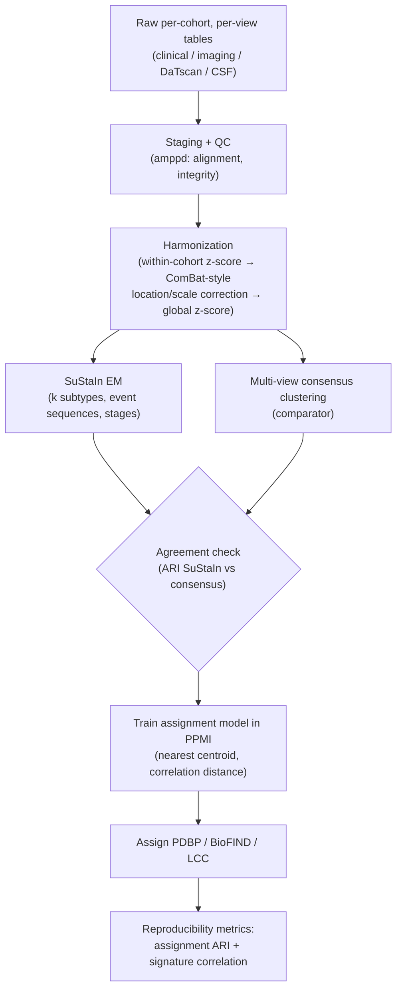
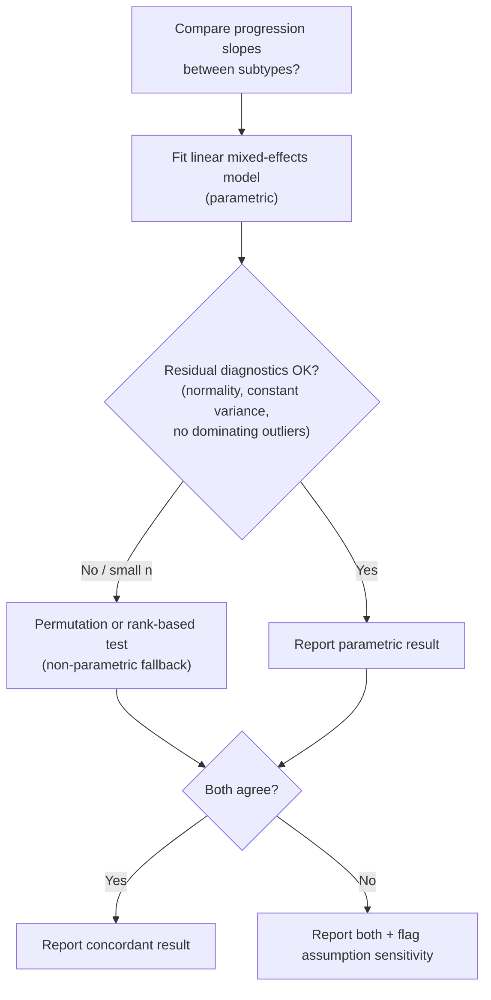

# Methods — Decisions, Rationale, and Scope

**Audience:** new contributors, including those new to data science. This page
documents what the pipeline does, *why* each methodological choice was made,
and which choices are still open. Read
[EXTENDED_INTRODUCTION.md](EXTENDED_INTRODUCTION.md) first if the domain is
new to you.

## Status: what exists vs. what is planned

### Done (implemented, tested, green CI)

- **Harmonization module** (`pd_subtypes.harmonize`): within-cohort z-scoring
  and a simplified ComBat-style location/scale batch correction, with
  optional preservation of biological covariates (age, sex, diagnosis) and a
  `cohort_shift_magnitude` batch-effect diagnostic.
- **SuStaIn-style EM** (`pd_subtypes.sustain.SuStaInModel`): subtype-and-stage
  inference as a mixture of biomarker event sequences, fit with EM, multiple
  random restarts (`n_init`), kept-best-by-log-likelihood.
- **Multi-view consensus clustering** (`pd_subtypes.multiview`): per-view PCA
  → per-view KMeans → average co-association matrix → agglomerative consensus
  clustering, as an independent comparator.
- **Cross-cohort assignment + metrics** (`pd_subtypes.reproducibility`):
  nearest-centroid (correlation-distance) assignment model,
  `assignment_agreement` (ARI), `subtype_signature_correlation`.
- **Terra staging loaders** (`pd_subtypes.amppd`, `scripts/prepare_amppd.py`):
  expected `<COHORT>_<view>.tsv` export layout, alignment/integrity QC,
  feature-matrix construction; raises a clear error when no export exists;
  includes a documented **semi-synthetic generator from published summary
  statistics**.
- **Semi-synthetic end-to-end validation** (*clearly labeled as not real
data*): 240 subjects × 3 cohorts, 12 features, 2 planted subtypes recovered;
  cross-cohort assignment ARI 0.95 (PDBP) / 1.0 (BioFIND), signature
  correlations ≥ 0.99 — see `reports/subtyping_summary.json`.
- **Tests**: 10 green pytest tests covering harmonization (removes planted
  batch shifts), SuStaIn (recovers planted subtypes), cross-cohort transfer,
  and Terra staging.

### Intended (blocked on data access or future work)

- **AMP-PD Tier 2 DUA** — owner action; issue #5.
- **Real-data harmonization QC** — issue #2.
- **Real subtyping (SuStaIn + consensus) on AMP-PD** — issue #4.
- **Cross-cohort validation on real data** — issue #3.
- **Release + writeup** — issue #1.

Until the DUA is approved, all development runs on `pd_subtypes.simulate`
synthetic data and the semi-synthetic stand-in (see
[DATA_ACCESS.md](DATA_ACCESS.md)).

## Analysis flowchart



## Key decisions and why

### Why harmonize *within cohort* before pooling

Cohorts differ in recruitment, scanners, assays, and protocols, so the same
biological state yields systematically shifted measurements per cohort. If we
pooled first, those technical shifts would look like patient clusters — the
algorithm would "discover" the cohort labels, not disease subtypes. We
therefore (i) z-score each feature **within each cohort** (so every cohort is
locally centered and scaled), then (ii) apply a **ComBat-style
location-and-scale correction** that removes per-cohort additive and
multiplicative effects while optionally preserving variance explained by
biological covariates, and finally (iii) apply a global z-score. The
`cohort_shift_magnitude` diagnostic lets us verify that planted batch shifts
are actually removed (the tests check exactly this). **Caveat:** this corrects
mean/scale shifts only; nonlinear or interaction batch effects would need
richer methods (e.g., full ComBat with empirical Bayes, or covariate-aware
harmonization like ComBat-GAM) — a candidate upgrade for the real-data QC
task (#2).

### Why SuStaIn *and* a consensus-clustering comparator (triangulation)

Every subtyping method bakes in assumptions. SuStaIn assumes disease is an
ordered accumulation of biomarker "events" and returns subtypes *plus stages*
— a strong, interpretable, clinically meaningful model [6]. But if its
assumptions are wrong for PD, we want to know. The multi-view consensus
clusterer makes almost no progression assumptions: it clusters each modality
separately (PCA + KMeans), counts how often pairs of subjects co-cluster
(the co-association matrix), and agglomerates on that consensus. If two very
different methods point at similar structure, confidence rises; where they
disagree (ARI quantifies it) is where we look hardest. In the semi-synthetic
run, SuStaIn recovered the planted subtypes well while the consensus
comparator agreed only moderately (ARI ≈ 0.41) — exactly the kind of
diagnostic signal triangulation is for: it tells us the progression-informed
structure is doing real work beyond naive clustering.

### Why nearest-centroid assignment for cross-cohort transfer

To test reproducibility we train in one cohort (PPMI) and assign subjects in
another (PDBP/BioFIND). The assignment model is deliberately the simplest
thing that can work: compute each subtype's **centroid** (mean signature) in
the training cohort, then assign each new subject to the nearest centroid by
**correlation distance**. Simple is robust here: with few subtypes and
harmonized features, a fancier classifier would mostly add overfitting risk
and tuning knobs, and correlation distance is naturally insensitive to
residual per-cohort scale differences. Soft assignments (softmax over
negative distances) give a confidence measure for the reproducibility audit.

### Why ARI + signature correlation as the reproducibility metrics

- **Assignment ARI** asks: *do the transferred assignments agree with what
the discovery method would have said on this cohort?* ARI is corrected for
chance agreement and label-permutation invariant, which is essential since
subtype "1" in PPMI need not be called "1" in PDBP.
- **Signature correlation** asks the complementary question: *does each
subtype's biomarker profile (centroid) look the same in the held-out cohort?*
A method could shuffle borderline subjects (lowering ARI) yet preserve the
biological meaning of each subtype (high signature correlation) — the two
metrics together separate "labels unstable" from "biology doesn't replicate."
In the semi-synthetic run: ARI 0.95/1.0 with signature correlations
0.99/0.997.

### How the number of subtypes *k* is chosen

**Primary rule (implemented direction): held-out likelihood.** Fit SuStaIn at
each candidate *k* on a training split; pick the *k* whose model assigns the
highest likelihood to held-out subjects. This directly tests generalization
rather than in-sample fit, which always improves with more subtypes.

Alternatives, presented because the final choice on real data is not yet
locked:

| Criterion | Idea | Strength | Weakness |
|---|---|---|---|
| **Held-out likelihood** (primary) | Generalization of the fitted mixture | Principled; matches the EM model | Needs enough subjects per split |
| **Out-of-sample stability** | Re-fit on resamples; measure agreement (ARI) of solutions | Directly measures "does k replicate" | Computationally heavier; threshold is judgment |
| **Silhouette / internal validity** | Geometric separation of clusters | Cheap, standard | Favors convex clusters; blind to progression structure |

**Choice rule:** require held-out likelihood to peak at *k* **and** stability
(ARI across resamples) to be acceptable at that *k*; silhouette is a sanity
check, not a decider. If criteria disagree, prefer the smaller *k* (parsimony)
and report the disagreement.

## Statistics for newcomers

### EM, convergence, and local optima

EM guarantees the likelihood never decreases — but it can converge to a
**local** optimum: a decent-but-wrong solution. That is why `SuStaInModel`
runs `n_init` random restarts and keeps the best log-likelihood. **Rule of
thumb:** if restarts disagree wildly, don't trust a single run — increase
`n_init`, and report the spread, not just the best. Convergence is declared
when the log-likelihood improvement falls below `tol` (1e-4) or `max_iter` is
hit; treat "hit max_iter" as a warning, not a result.

### Model selection and clustering without ground truth

With no true labels, validation has to come from (i) generalization
(held-out likelihood), (ii) stability (resampling), and (iii) external
criteria (do subtypes differ on held-out variables like genotype [7] or
longitudinal decline?). Never select *k* by in-sample fit. On synthetic data
we *do* have ground truth (planted subtypes) — that is exactly what the test
suite and the semi-synthetic report exploit, and why real-data claims will be
phrased more cautiously.

### Parametric vs. non-parametric: a decision guide

Later tasks (e.g., comparing progression slopes between subtypes, Paper 2
territory) force a choice:

- **Parametric** (e.g., linear mixed-effects models for longitudinal slopes):
  assume a functional form and a distribution for errors/random effects.
  *Pros:* efficient, interpretable, handles repeated measures and uneven
  follow-up natively. *Cons:* wrong assumptions → wrong p-values.
- **Non-parametric / robust** (permutation tests, rank-based tests like
  Mann–Whitney/Kruskal–Wallis, bootstrap CIs): few or no distributional
  assumptions. *Pros:* trustworthy under weird distributions and outliers.
  *Cons:* less power, harder to adjust for covariates/repeated measures.

**Choice rule (planned):** start with the parametric model (linear mixed
model for slopes), then **check residuals** — normality (Q–Q plot),
heteroscedasticity, influential points. If diagnostics pass, report the
parametric result. If they fail or sample sizes per subtype are small, fall
back to permutation/rank-based tests, and report both when they disagree.
Where this is genuinely undecided (it is, until real data), both options and
this rule are the deliverable — not a premature commitment.



### Discover-in-one-cohort, test-in-another

Discovering structure and confirming it on the *same* people is circular —
the model can memorize cohort quirks. The gold standard is an **external**
split at the cohort level: discover subtypes in PPMI, freeze the model, then
ask whether it assigns and describes patients consistently in PDBP, BioFIND,
and LCC. Because cohorts differ in recruitment and measurement, surviving
this test is much stronger evidence than an internal train/test split. Our
`reproducibility` module implements exactly this design.

### Missing data and imputation

Real AMP-PD data will have missing modalities (not every participant has CSF
or DaTscan). Options: complete-case analysis (simple, biased if missingness
is informative), **multiple imputation** (planned per INTRODUCTION.md:
impute several plausible values, analyze each, pool results — preserves
uncertainty), or models that handle missingness natively. **Choice rule:**
quantify missingness per view/cohort first; if <~5% and plausibly random,
complete-case per analysis is acceptable; otherwise multiple imputation, with
a missingness-indicator sensitivity check. Currently only the plan exists —
synthetic data is complete by construction.

### Batch vs. biology: the confounding trap

If cohort membership correlates with biology (e.g., one cohort enrolls older
or more advanced patients), batch correction can remove real signal, and
*under*-correction leaves fake signal — you can't win by automation. Our
defenses: (i) preserve named biological covariates during ComBat-style
correction, (ii) diagnose with `cohort_shift_magnitude` before/after, (iii)
validate subtypes on variables not used to discover them (genotype,
longitudinal outcomes). On real data (issue #2) we will additionally report
how cohort and subtype distributions overlap before claiming success.

## Reproducing the current validation

```bash
pip install -e ".[dev]"
python -m pytest -q                                    # 10 tests
python scripts/prepare_amppd.py --semi-synthetic --out data/prepared
python scripts/run_subtyping.py --prepared data/prepared   # writes reports/
```

Results land in `reports/subtyping_summary.json` (semi-synthetic stand-in —
**not real participant data**).
