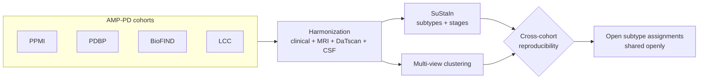

# Concept figure — PD Multimodal Subtype Discovery

**Caption:** The discovery pipeline. Four harmonized AMP-PD cohorts (PPMI, PDBP, BioFIND, LCC) contribute clinical, MRI, DaTscan, and CSF features; two independent engines — SuStaIn (subtypes with within-subtype progression stages) and multi-view consensus clustering — propose subtype structure; and only subtypes that transfer across cohorts (assignment agreement, matched biomarker profiles, genetic association) become the open subtype assignments released for reuse in progression-prediction and blood-proxy studies.

*A rendered PNG concept figure was generated for this repository; because binary assets cannot be committed through the tooling used for this update, this file carries the faithful Mermaid source of the same diagram.*
